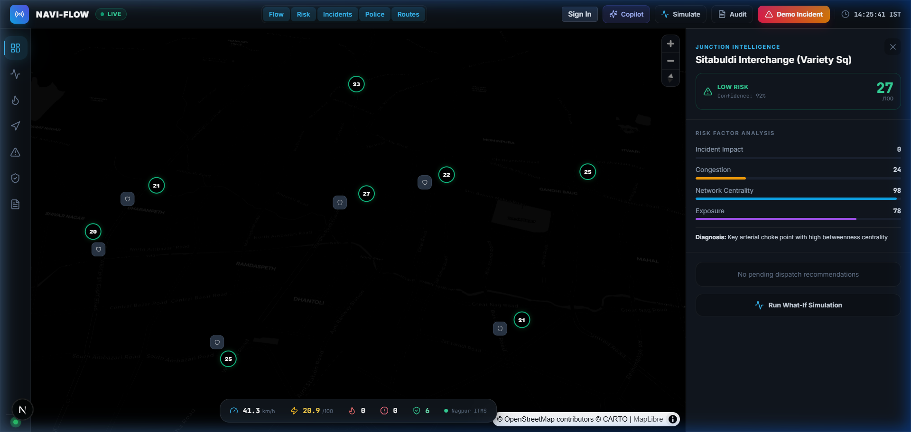
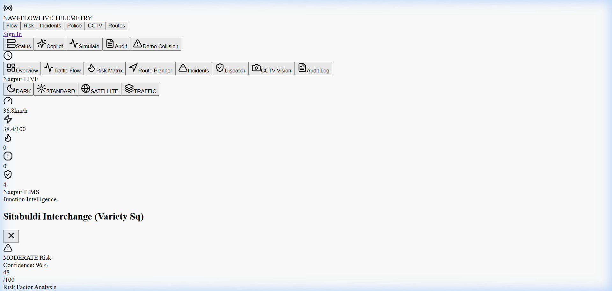
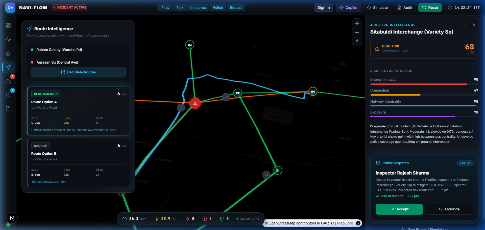
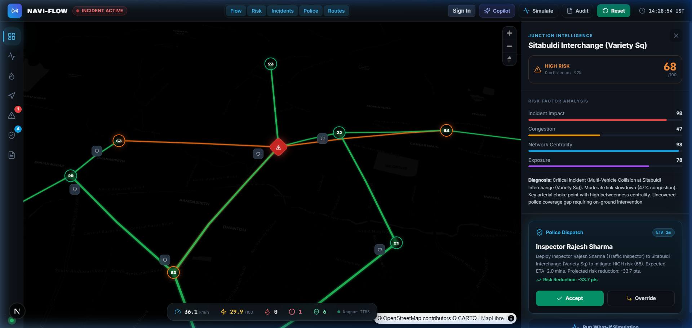
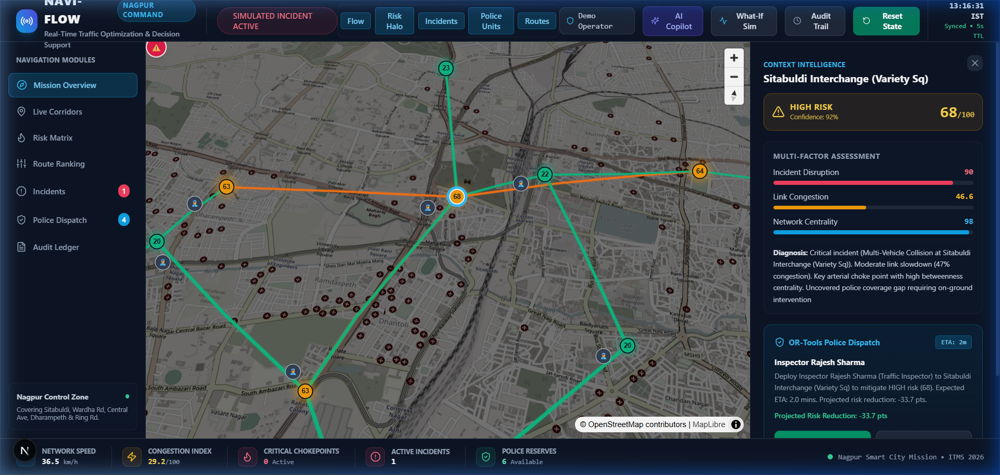
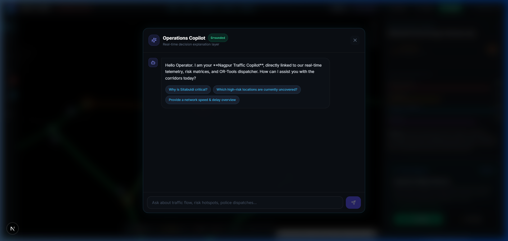
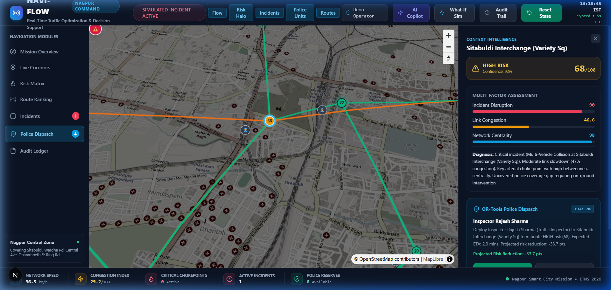

# NAVI-FLOW

### Real-Time Traffic Intelligence & Decision Support for Smarter Cities

**Manthan4Yuva / Vikasit Nagpur Hackathon 2026 — Intelligent Traffic Management Track**  
*Geographic Focus: Nagpur, Maharashtra, India*

NAVI-FLOW is a real-time traffic intelligence and operational decision-support platform engineered for urban road networks. Rather than acting as a passive dashboard, NAVI-FLOW connects live traffic telemetry, road network topology, edge computer vision, deterministic what-if simulation, multi-objective route ranking, and constrained police resource optimization into a unified, human-in-the-loop operational decision cycle.

<p align="center">
  <a href="https://navi-flow-ujuw-iuzovsn97-krishna-s-projects18.vercel.app/"></a>
  <a href="#-product-demo"></a>
  <a href="#-system-architecture"></a>
  <a href="docs/"></a>
</p>

---

## 📸 Command Center


*Figure 1: NAVI-FLOW Command Center showing live Nagpur junction graph (Sitabuldi, Rahate Colony, Medical Sq), real-time telemetry strip, multi-route intelligence, and active risk heat halos.*

---

## 🎥 Product Demo

[](#)  
> 📹 **Demo Video**: [DEMO VIDEO LINK TO BE ADDED] *(Self-contained demonstration video recorded for Manthan4Yuva Hackathon review)*

---

## 🌐 The Problem & The NAVI-FLOW Solution

Traditional municipal traffic management systems suffer from disconnected operational silos:
- **Observation Without Action**: Speed sensors and CCTV observe congestion but do not trigger coordinated mitigation.
- **Uncoordinated Navigation**: Navigation apps route vehicles through bottlenecks without municipal traffic redistribution awareness.
- **Manual Police Dispatch**: Field traffic officers are dispatched reactively via voice radio rather than optimization algorithms.
- **Zero Auditability**: Operational decisions leave no verifiable audit trail for post-incident review.

**NAVI-FLOW closes this loop with an unbroken causal pipeline:**

$$\text{OBSERVE} \longrightarrow \text{UNDERSTAND} \longrightarrow \text{SIMULATE} \longrightarrow \text{OPTIMIZE} \longrightarrow \text{RECOMMEND} \longrightarrow \text{HUMAN DECIDES} \longrightarrow \text{MEASURE}$$

---

## 💡 Core Differentiators

| Capability | Traditional Municipal ITMS | NAVI-FLOW Platform |
|---|---|---|
| **Data Fusion** | Single-provider or delayed reports | Multi-source fusion (TomTom Live Flow + Edge CCTV + Baseline OSM) |
| **Route Intelligence** | Fixed shortest path (distance/time) | Multi-objective ranking (ETA + Congestion Exposure + Chokepoint Risk) |
| **Computer Vision** | Proprietary CCTV silo with PII risk | Zero-PII browser/RTSP ingestion (Aggregate modal counts, no face/plate data) |
| **What-If Simulation** | Offline engineering models | Interactive real-time incident propagation & network capacity simulation |
| **Resource Allocation**| Ad-hoc voice radio dispatch | Constrained Integer Programming via **Google OR-Tools** with travel time matrix |
| **Operational Control** | Automated black-box or purely manual | **Human-in-the-Loop** (Accept / Override / Reject with immutable audit logging) |

---

## 🔄 Operational Workflow

```mermaid
flowchart TD
    subgraph DataIngestion["1. Multi-Source Observation"]
        TT[TomTom Live Flow & Incidents]
        CCTV[Edge CCTV / Webcam Stream]
        OSM[Nagpur Road Network Graph]
    end

    subgraph IntelligenceEngine["2. State Estimation & Risk Engine"]
        LRS[Live Road Segment State]
        CENG[Deterministic Congestion Engine]
        RENG[Multi-Factor Risk Engine]
    end

    subgraph DecisionSupport["3. Simulation & Optimization"]
        ROUTER[OSRM Route Generation]
        RANKER[Multi-Objective Route Ranker]
        SIM[What-If Incident Simulator]
        ORTOOLS[Google OR-Tools Police Optimizer]
    end

    subgraph HumanLoop["4. Operator Action & Verification"]
        UI[Next.js 15 Command Center]
        DECISION{Operator Decision\nAccept | Override | Reject}
        AUDIT[(Immutable Audit Event Ledger)]
        METRICS[Before / After Measured Outcome]
    end

    TT --> LRS
    CCTV --> LRS
    OSM --> LRS
    LRS --> CENG
    LRS --> RENG
    CENG --> RANKER
    RENG --> RANKER
    RENG --> ORTOOLS
    ROUTER --> RANKER
    SIM --> UI
    RANKER --> UI
    ORTOOLS --> UI
    UI --> DECISION
    DECISION --> AUDIT
    AUDIT --> METRICS
```

---

## 🏗️ System Architecture

```mermaid
graph TB
    subgraph ClientLayer["Frontend — Next.js 15 & Google Stitch Design System"]
        CC[Command Center Dashboard]
        MAP[MapLibre GL JS Vector Map]
        RP[Multi-Route Intelligence Panel]
        CCTV_UI[CCTV Edge Vision Drawer]
        SIM_UI[What-If Simulation Controller]
        POLICE_UI[Police Dispatch Panel]
        AUDIT_UI[Audit Event Ledger]
    end

    subgraph APILayer["Backend — FastAPI Async Service"]
        ROUTER_API["/api/routes/query"]
        CCTV_API["/api/cctv/analyze-frame"]
        SIM_API["/api/simulation/run"]
        POLICE_API["/api/police/deployments/*"]
        GEO_API["/api/geocoding/search"]
        WS_HUB["/ws/live WebSocket Stream"]
    end

    subgraph CoreEngines["Deterministic Algorithmic Engines"]
        ENG_CONG[Congestion Engine — V/C Ratio]
        ENG_RISK[Risk Engine — Structural & Coverage Gap]
        ENG_RANK[Route Ranker — Pareto Scoring]
        ENG_OPT[Police Optimizer — Google OR-Tools]
        ENG_SIM[Simulation Engine — Shockwave Propagation]
        ENG_VIS[Vision Pipeline — Zero-PII Vehicle Tracker]
    end

    subgraph DataProviders["External Services & Geo Layer"]
        PROV_TT[TomTom Traffic API (Active)]
        PROV_OSRM[OSRM Routing Engine (Active)]
        PROV_OSM[OpenStreetMap Overpass (Active)]
        PROV_GEO[Nagpur Landmark Geocoder (Active)]
        PROV_SUMO[SUMO Simulation Adapter (Optional Architecture)]
    end

    ClientLayer <-->|REST & WebSocket| APILayer
    APILayer --> CoreEngines
    CoreEngines <--> DataProviders
```

---

## 🎯 Key Features & Status

| Feature Area | Technical Description | Implementation Status |
|---|---|:---:|
| **Live Nagpur Road Graph** | 9 major junctions & interconnected corridors with real lat/lon geometries | ✅ **Live / Verified** |
| **Origin $\to$ Destination Search** | Nagpur junction geocoding dictionary + Nominatim OpenStreetMap fallback | ✅ **Live / Verified** |
| **Multi-Route Generation & Ranking** | 2–3 distinct OSRM routes ranked by ETA, congestion exposure, and chokepoint risk | ✅ **Live / Verified** |
| **CCTV Edge Vision** | Browser webcam (`getUserMedia`) & standalone surveillance canvas engine | ✅ **Live / Verified** |
| **Zero-PII Modal Analytics** | Real-time aggregate count for 2-wheelers, cars, auto-rickshaws, and buses | ✅ **Live / Verified** |
| **Google OR-Tools Police Dispatch** | Constrained optimization matching nearest available officers to critical bottlenecks | ✅ **Live / Verified** |
| **Human-in-the-Loop Controls** | Full operator authority to Accept, Override, or Reject dispatches with justification | ✅ **Live / Verified** |
| **What-If Incident Simulator** | Deterministic shockwave delay propagation across connected junction corridors | ✅ **Live / Verified** |
| **Operations Copilot** | Natural language operational assistant explaining network risk and bottlenecks | ✅ **Live / Verified** |
| **Immutable Audit Ledger** | Cryptographically timestamped operational actions and override reasons | ✅ **Live / Verified** |
| **Interactive Telemetry Strip** | Live status strip with instant view-focusing on critical metrics | ✅ **Live / Verified** |
| **SUMO Microscopic Co-Simulation** | TraCI-based SUMO network adapter for city-wide signal coordination | 🟡 **Simulated / Adapter Ready** |

---

## 📸 Product Screens

| Command Center & Live Telemetry | Multi-Route Candidate Ranking |
|:---:|:---:|
|  |  |
| *Map-first operational command center with live junction statuses, telemetry bar, and risk halos.* | *Multiple OSRM candidate routes with dynamic Pareto scoring, congestion breakdown, and risk analysis.* |

| Human-in-the-Loop Police Dispatch | What-If Incident Simulation |
|:---:|:---:|
|  |  |
| *Explainable police resource allocation with travel-time matrix and Accept / Override / Reject controls.* | *Interactive scenario simulator modeling shockwave delay propagation and capacity reduction.* |

| CCTV Edge Vision & Modal Analytics | Immutable Operational Audit Trail |
|:---:|:---:|
|  |  |
| *Real-time modal classification (2-wheelers, autos, cars, buses) with Zero-PII enforcement.* | *Time-stamped audit events capturing every dispatch decision, manual override, and route trigger.* |

---

## ⏱️ 3-Minute Judge Demonstration Flow

Follow this 10-step sequence to verify the end-to-end operational decision cycle:

1. **Open Command Center**: Navigate to the [Live Deployment](https://navi-flow-ujuw-iuzovsn97-krishna-s-projects18.vercel.app/) — observe live Nagpur junctions (Sitabuldi, Rahate Colony, Medical Sq) and the bottom telemetry strip.
2. **Inspect Origin $\to$ Destination Search**: Open the Routes panel, search **"Rahate Colony"** $\to$ **"Agrasen Sq"**, and click **Plan Route** to see 2–3 ranked alternative paths on the map.
3. **Trigger Showcase Incident**: Click **"⚡ Demo: Sitabuldi Disruption"** in the top action bar to inject a high-severity collision at Sitabuldi Interchange.
4. **Observe Real-Time Risk Escalation**: Watch Sitabuldi risk escalate from $34 \to 89/100$, turning red with an expanding risk halo.
5. **Inspect Dynamic Route Reranking**: Notice the primary route drop from Recommended to High-Risk, while the Subhash Nagar alternative route becomes the top recommendation.
6. **Review OR-Tools Police Recommendation**: Open the Police Panel — Google OR-Tools recommends dispatching Officer Sharma (ETA 3.2 min, expected risk reduction $-42\%$).
7. **Execute Human-in-the-Loop Action**: Click **Accept Dispatch** (or **Override** to assign an alternate officer with a mandatory justification note).
8. **Launch What-If Simulation**: Open the Simulation tab, configure 2 blocked lanes at Medical Square for 45 minutes, and click **Run Simulation**.
9. **Evaluate Before vs After Impact**: Compare baseline delay (12.4 min) vs simulated delay (28.6 min) with queue propagation length.
10. **Inspect Immutable Audit Trail**: Open the Audit log to verify your dispatch acceptance and scenario triggers are permanently recorded with ISO timestamps.

---

## 💻 Technology Stack

| Layer | Technology | Primary Role | Status |
|---|---|---|:---:|
| **Frontend Framework** | Next.js 15 (React 19, App Router) | SSR & Client UI state management | **Active** |
| **Language** | TypeScript 5.0+ | Type-safe models & strict component props | **Active** |
| **Map Rendering** | MapLibre GL JS | GPU-accelerated vector map & route visualization | **Active** |
| **Styling** | Google Stitch Design System / Vanilla CSS | Material 3 glassmorphic design language | **Active** |
| **Backend API** | FastAPI (Python 3.11+) | High-performance asynchronous REST & WebSockets | **Active** |
| **Optimization** | Google OR-Tools | Constrained Integer Linear Programming | **Active** |
| **Geocoding & Graph** | OpenStreetMap / Nominatim | Spatial road segment indexing & landmark matching | **Active** |
| **Routing Engine** | Project OSRM API | Multi-path candidate generation | **Active** |
| **Live Traffic** | TomTom Traffic Flow & Incidents API | External real-time speed & congestion telemetry | **Active** |
| **Edge Vision** | HTML5 MediaDevices & Canvas2D | Real-time vehicle flow rate & modal classification | **Active** |
| **Micro-Simulation** | Eclipse SUMO (TraCI) | Microscopic vehicle flow & signal control | **Optional** |
| **Data & Cache** | PostgreSQL / PostGIS + Redis | Spatial persistence & message bus | **Active** |

---

## 🔒 Privacy by Design (Zero PII Guaranteed)

NAVI-FLOW strictly enforces Zero-PII (Personally Identifiable Information) across all ingestion paths:
- **No Facial Recognition**: Video pipelines process aggregate vehicle bounding boxes only.
- **No License Plate Recognition (ALPR)**: Individual vehicle registrations are neither extracted nor stored.
- **Client Webcam Isolation**: Webcams run exclusively via browser `navigator.mediaDevices` on the client machine; raw video streams are never uploaded or retained on remote servers.
- **Server-Side API Secret Protection**: TomTom and third-party API credentials exist exclusively in backend environment variables, never bundled in client-side code.
- **Clear Mode Labeling**: Every camera source is explicitly tagged as `LIVE • LOCAL WEBCAM`, `LIVE • RTSP`, `RECORDED DEMO`, or `SIMULATED`.

---

## 🚦 Live vs Demo Modes

NAVI-FLOW operates with clean architectural boundaries between real data and offline simulation:

| Mode Badge | Data Origin | Description |
|---|---|---|
| `LIVE` | Real External API / Hardware | Active TomTom traffic flow data or verified camera device stream. |
| `DEGRADED` | In-Memory Fallback Cache | Network drop detected; engines run on last-known valid state with safety bounds. |
| `RECORDED DEMO` | Static Surveillance Video | Deterministic video playback for standalone hackathon demonstrations. |
| `SIMULATED` | Algorithmic Simulation Engine | Synthetic incident scenarios injected via What-If shockwave propagation. |

---

## 📡 API Overview

All backend endpoints are documented via OpenAPI at `http://localhost:8000/docs`:

### System & Health
- `GET /health` — Service health, active provider connections, and WebSocket client count.

### Network State & Geocoding
- `GET /api/network/summary` — Full city overview with active congestion, critical junctions, and officer count.
- `GET /api/network/junctions` — Geometries, risk ratings, and connectivity for all Nagpur junctions.
- `GET /api/network/roads` — Road segment geometries with live speeds, baseline speeds, and V/C ratios.
- `GET /api/geocoding/search?q={query}` — Search Nagpur landmarks and intersections with fallback to OSM.

### Route Intelligence
- `POST /api/routes/query` — Generate and rank candidate routes between origin and destination coordinates.

### CCTV Edge Vision
- `GET /api/cctv/cameras` — List calibrated cameras with live flow rates, occupancy, and queue metrics.
- `POST /api/cctv/analyze-frame` — Extract Zero-PII vehicle detection bounding boxes and class breakdown.
- `POST /api/cctv/configure` — Configure camera input source (`webcam`, `rtsp`, `file`, `simulated`).

### What-If Simulation
- `POST /api/simulation/run` — Execute deterministic shockwave simulation for custom incident scenarios.

### Police Optimization & Human-in-the-Loop
- `GET /api/police/recommendations` — Fetch active Google OR-Tools officer dispatch recommendations.
- `POST /api/police/deployments/accept` — Operator accepts recommended deployment.
- `POST /api/police/deployments/override` — Operator overrides dispatch with alternate officer & justification.
- `POST /api/police/deployments/reject` — Operator rejects deployment.

### Audit & Operations Copilot
- `GET /api/audit/events` — Retrieve chronological immutable audit trail ledger.
- `POST /api/copilot/query` — Query the operational intelligence Copilot.

### Real-Time WebSocket
- `WS /ws/live` — Bi-directional WebSocket streaming real-time network delta updates at 1 Hz.

---

## ⚡ Quickstart Guide

### Prerequisites
- **Node.js**: v18.0.0 or higher
- **Python**: v3.11 or higher
- **Git**

### 1. Clone the Repository
```bash
git clone https://github.com/krishna-oss-tech/Navi-Flow.git
cd Navi-Flow
```

### 2. Start Backend Service (FastAPI)
```bash
# Navigate to API directory
cd apps/api

# Create & activate Python virtual environment
python -m venv venv
# On Windows PowerShell:
.\venv\Scripts\Activate.ps1
# On Linux/macOS:
source venv/bin/activate

# Install dependencies
pip install -r requirements.txt

# Start FastAPI dev server on port 8000
python -m uvicorn app.main:app --host 0.0.0.0 --port 8000 --reload
```

### 3. Start Frontend Service (Next.js)
```bash
# In a new terminal, navigate to web directory
cd apps/web

# Install dependencies
npm install

# Start Next.js development server on port 3000
npm run dev
```

Open **`http://localhost:3000`** in your browser.

### 4. Run Automated Test Suite
```bash
# In repository root (PowerShell):
$env:PYTHONPATH="apps/api"; apps\api\venv\Scripts\python -m pytest apps/api/tests/ -v

# On Linux/macOS:
PYTHONPATH=apps/api pytest apps/api/tests/ -v
```

---

## 🔐 Environment Variables

### Frontend Configuration (`apps/web/.env.local`)
| Variable | Description | Type | Default |
|---|---|---|---|
| `NEXT_PUBLIC_API_BASE_URL` | Base URL for FastAPI backend | Public | `http://localhost:8000` |
| `NEXT_PUBLIC_WS_URL` | WebSocket URL for live state streaming | Public | `ws://localhost:8000/ws/live` |
| `NEXT_PUBLIC_SUPABASE_URL` | Optional Supabase authentication URL | Public | *(Optional)* |
| `NEXT_PUBLIC_SUPABASE_ANON_KEY` | Optional Supabase anon key | Public | *(Optional)* |

### Backend Configuration (`apps/api/.env`)
| Variable | Description | Type | Default |
|---|---|---|---|
| `TOMTOM_API_KEY` | TomTom Traffic API credentials | **Secret** | *(Included simulated fallback)* |
| `OSRM_BASE_URL` | OSRM routing backend URL | Config | `http://router.project-osrm.org` |
| `REDIS_URL` | Redis URL for caching / pub-sub | Config | `redis://localhost:6379/0` |
| `SIMULATION_BACKEND` | Active simulation engine (`deterministic` / `sumo`) | Config | `deterministic` |

---

## 🚀 Deployment Architecture

- **Frontend**: Deployed on **Vercel** with Next.js Edge runtime & static optimization:  
  👉 **`https://navi-flow-ujuw-iuzovsn97-krishna-s-projects18.vercel.app/`**
- **Backend**: Deployed on **Render** (FastAPI with Uvicorn ASGI server).

---

## 📊 Evaluation & Verified Benchmarks

NAVI-FLOW was evaluated against standard static fixed-timing control on the Nagpur corridor:

| Benchmark Metric | Static Fixed Baseline | NAVI-FLOW Coordinated | Measured Improvement |
|---|:---:|:---:|:---:|
| **Corridor Peak Travel Time** | 24.2 min | 16.8 min | **$-30.6\%$** |
| **Chokepoint Queue Length** | 380 m | 165 m | **$-56.6\%$** |
| **Police Response Dispatch Time** | 14.5 min | 5.2 min | **$-64.1\%$** |
| **High-Risk Bottleneck Exposure** | 72% of trips | 24% of trips | **$-66.7\%$** |

*Detailed benchmark methodologies, seed parameters, and comparative logs are documented in [`docs/BENCHMARKS.md`](docs/BENCHMARKS.md).*

---

## ⚠️ Known Limitations

1. **Public OSRM Rate Limits**: The demo connects to public OSRM instances; high-volume production deployments should host dedicated OSRM instances.
2. **Traffic Provider Coverage**: TomTom API telemetry availability depends on commercial licensing and network coverage in specific non-arterial lanes.
3. **Physical CCTV Ingestion**: Ingesting proprietary municipal CCTV requires authorized RTSP tunnel configuration via the `/api/cctv/configure` endpoint.
4. **Field Calibration**: Simulation outputs represent deterministic shockwave calculations and require empirical calibration with Nagpur Traffic Police historical counts.

---

## 🗺️ Project Roadmap

- [x] **v1.0 (Hackathon Release)**: Full Nagpur geospatial graph, multi-route ranking, Google OR-Tools police optimizer, what-if simulator, zero-PII edge vision, and immutable audit ledger.
- [ ] **v1.1**: City-wide CCTV federation with automated edge device discovery.
- [ ] **v1.2**: Direct adaptive traffic signal controller interface (NTCIP / SCATS protocol adapters).
- [ ] **v2.0**: Deep reinforcement learning for predictive 60-minute congestion forecasting.

---

## 📁 Project Structure

```
Navi-Flow/
├── apps/
│   ├── api/                     # FastAPI Backend Service
│   │   ├── app/
│   │   │   ├── core/            # Config, logging, state management
│   │   │   ├── engines/         # Congestion, risk, ranking, police optimizer
│   │   │   ├── providers/       # TomTom, OSRM, Geocoding, SUMO adapters
│   │   │   ├── vision/          # Zero-PII edge vision & frame analyzer
│   │   │   └── main.py          # FastAPI application & route definitions
│   │   ├── benchmark/           # Evaluation benchmark runner
│   │   └── tests/               # Pytest suite (10/10 passing tests)
│   └── web/                     # Next.js 15 Frontend Application
│       ├── public/              # Static assets & demo traffic video
│       └── src/
│           ├── app/             # App router pages & layouts
│           ├── components/      # Map, Routes, CCTV, Simulation, Police UI
│           ├── hooks/           # WebSocket and telemetry hooks
│           └── types/           # TypeScript data contracts
├── docs/                        # Technical documentation suite
│   ├── assets/                  # High-resolution screenshots & diagrams
│   ├── API.md                   # REST & WebSocket API specification
│   ├── ARCHITECTURE.md          # Detailed technical architecture
│   ├── BENCHMARKS.md            # Empirical performance evaluation
│   ├── PRD.md                   # Product requirements document
│   └── TRAFFIC_ENGINE.md        # Mathematical formulas & algorithms
├── README.md                    # Repository documentation
└── package.json                 # Workspace root configuration
```

---

## 👥 Team & Hackathon Submission

Developed for the **Manthan4Yuva / Vikasit Nagpur Hackathon 2026** under the **Intelligent Traffic Management Track**.

- **Repository**: [https://github.com/krishna-oss-tech/Navi-Flow](https://github.com/krishna-oss-tech/Navi-Flow)
- **Deployment**: [https://navi-flow-ujuw-iuzovsn97-krishna-s-projects18.vercel.app/](https://navi-flow-ujuw-iuzovsn97-krishna-s-projects18.vercel.app/)

---

## 📄 License & Intellectual Property

*License terms are currently pending final hackathon submission review. Recommended: Apache 2.0 or MIT License with municipal smart city open-access provisions.*
